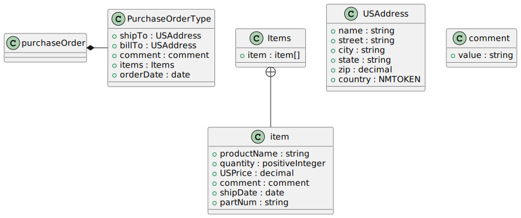

`xsData <https://github.com/tefra/xsdata>`_ PlantUML Plugin
===========================================================

Generate `PlantUML <https://plantuml.com/class-diagram>`_ class diagrams from xml
schemas, wsdl definitions and directly from xml documents.

Usage
=====

.. code-block:: bash

    $ pip install xsdata-plantuml

    $ xsdata samples/order.xsd --output plantuml --package samples

.. code-block::

    @startuml

    class Items {
        +item : item[]
    }
    Items +-- item
    class item {
        +productName : string
        +quantity : positiveInteger
        +USPrice : decimal
        +comment : string
        +shipDate : date
        +partNum : string
    }
    class PurchaseOrderType {
        +shipTo : USAddress
        +billTo : USAddress
        +comment : string
        +items : Items
        +orderDate : date
    }
    class USAddress {
        +name : string
        +street : string
        +city : string
        +state : string
        +zip : decimal
        +country : NMTOKEN
    }
    class comment {
        +@value : string
    }
    class purchaseOrder {
    }
    purchaseOrder *- PurchaseOrderType

    @enduml

